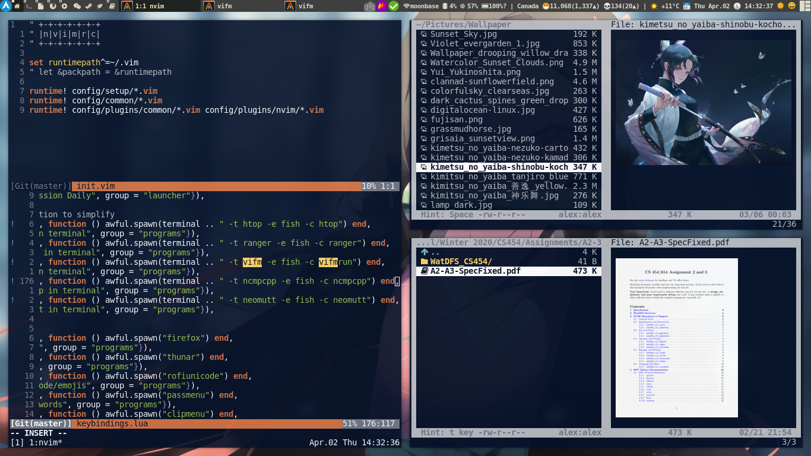

# dotfiles

**Just copy whatever you need.** 

## Notes
I use [stow][gnustow] to manage my dotfiles.
However, there are a lot of good dotfile manager [alternatives](https://wiki.archlinux.org/index.php/Dotfiles).

### Use case
Say I am on a new machine, and I want to grab my configurations for x related, vifm, vim, nvim, tmux.

I would run the following script. [stow][gnustow] creates symlinks 
```
# install.sh
stow -v -d . -t ~/ x
stow -v -d . -t ~/ vifm
stow -v -d . -t ~/ vim
stow -v -d . -t ~/ nvim
stow -v -d . -t ~/ tmux
```

## Highlights you may be interested
- vifm
- tmux
- vim
- nvim
- awesomewm
- (neo)mutt (config modified after generating from [mutt-wizard](https://github.com/LukeSmithxyz/mutt-wizard))
- scripts
    - weather
    - corona
    - key-handler for sxiv

## Screenshot
neofetch+coronascript

tmux+nvim+vifm

sxiv+neomutt+newsboat


[gnustow]: https://www.gnu.org/software/stow/
