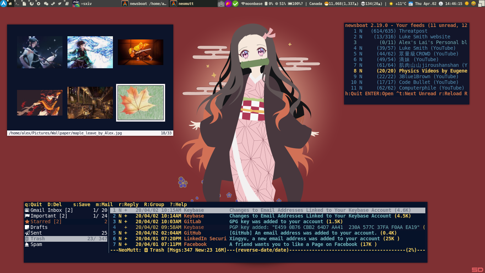

# dotfiles
**Update: Further updates will be managed by chemoi at https://gitlab.com/alexlai97/dotfiles**

**Just copy whatever you need.** 

## Notes
I use [stow][gnustow] to manage my dotfiles.
However, there are a lot of good dotfile manager [alternatives](https://wiki.archlinux.org/index.php/Dotfiles).

### Use case
Say I am on a new machine, and I want to grab my configurations for x related, vifm, vim, nvim, tmux.

I would run the following script. [stow][gnustow] creates symlinks.
```
# install.sh
stow -v -d . -t ~/ x
stow -v -d . -t ~/ vifm
stow -v -d . -t ~/ vim
stow -v -d . -t ~/ nvim
stow -v -d . -t ~/ tmux
```

## you may be interested in
- [vifm](./vifm/.config/vifm/)
- [tmux](./tmux/.tmux.conf)
- [vim](./vim/.vim/)
- [nvim](./nvim/.config/nvim/)
- [doom-emacs](./doom-emacs/.config/doom/)
- [awesomewm](./awesome/.config/awesome/)
- [xmonad](./xmonad)
- [(neo)mutt](./mutt/.config/mutt/) (config modified after generating from [mutt-wizard](https://github.com/LukeSmithxyz/mutt-wizard))
- [scripts](./scripts/.scripts/)
    - [weather](./scripts/.scripts/weather)
    - [corona](./scripts/.scripts/corona)
    - [key-handler for sxiv](./sxiv/.config/sxiv/exec/key-handler)

## Screenshot
xmonad+doom-emacs

awesome+neofetch+coronascript

awesome+tmux+nvim+vifm

awesome+sxiv+neomutt+newsboat


[gnustow]: https://www.gnu.org/software/stow/
